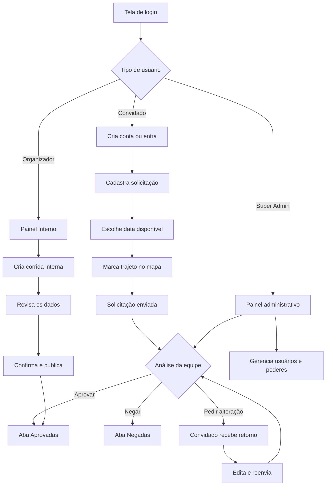

# Fluxograma resumido do sistema

## Perfis

- **Administrador:** gerencia usuários e também avalia solicitações.
- **Organizador:** avalia solicitações e cadastra corridas internas com revisão antes da publicação.
- **Convidado:** envia e acompanha somente as próprias solicitações.

